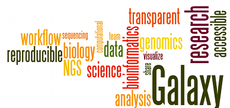

## Course Description
This course provides a practical introduction to Galaxy for the complete novice. Participants are lead through core aspects of Galaxy with a focus on analysis of RNA-seq data, using a case study.

## Course Objectives

After this course you should be able to:

* Perform QC of RNA-seq data (fastq, BAM and count files)
* Perform a differential expression analysis
* Create workflows for analysis of RNA-seq data in Galaxy
* Know what tools are available for RNA-seq analysis in Galaxy

## Topics Covered

### Day 1
- Introduction to Galaxy
- RNA-Seq reads to counts

### Day 2
- RNA-Seq counts to genes
- RNA-Seq genes to pathways

## Course Materials

### Day 1
- [Introduction to Galaxy](https://galaxyproject.github.io/training-material/topics/introduction/tutorials/galaxy-intro-short/tutorial.html)
- [RNA-Seq reads to counts](https://galaxyproject.github.io/training-material/topics/transcriptomics/tutorials/rna-seq-reads-to-counts/tutorial.html)

### Day 2
- [RNA-Seq counts to genes](https://galaxyproject.github.io/training-material/topics/transcriptomics/tutorials/rna-seq-counts-to-genes/tutorial.html)
- [RNA-Seq genes to pathways](https://galaxyproject.github.io/training-material/topics/transcriptomics/tutorials/rna-seq-genes-to-pathways/tutorial.html)

### Extra
- [Visualization of RNA-Seq results with Volcano Plot](https://galaxyproject.github.io/training-material/topics/transcriptomics/tutorials/rna-seq-viz-with-volcanoplot/tutorial.html)
- [Visualization of RNA-Seq results with heatmap2](https://galaxyproject.github.io/training-material/topics/transcriptomics/tutorials/rna-seq-viz-with-heatmap2/tutorial.html)

## Course Presenters/Helpers

- Maria Doyle, Research Computing Facility
- Richard Lupat, Bioinformatics Core

## Acknowledgements
This course is run by the Peter Mac Data Science Training team and uses material from the [Galaxy Training Network](https://galaxyproject.org/teach/gtn/)

## Useful Resources
+ [Galaxy Europe](https://usegalaxy.eu/)
+ [Galaxy Training](https://galaxyproject.github.io/training-material/)
+ [Galaxy Help](https://help.galaxyproject.org)
